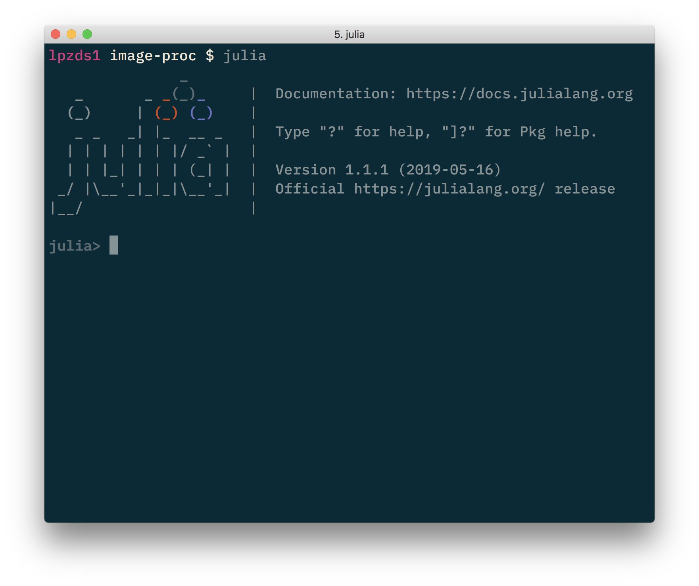
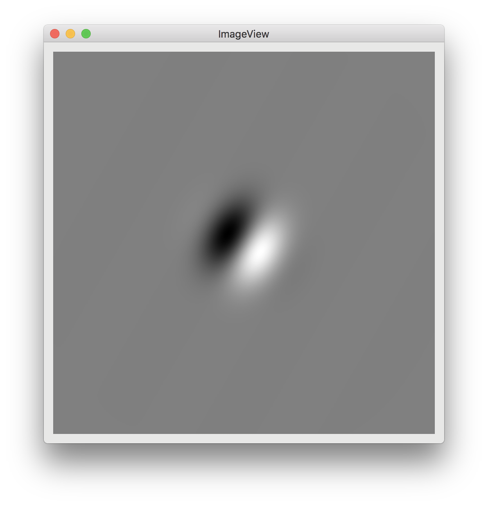
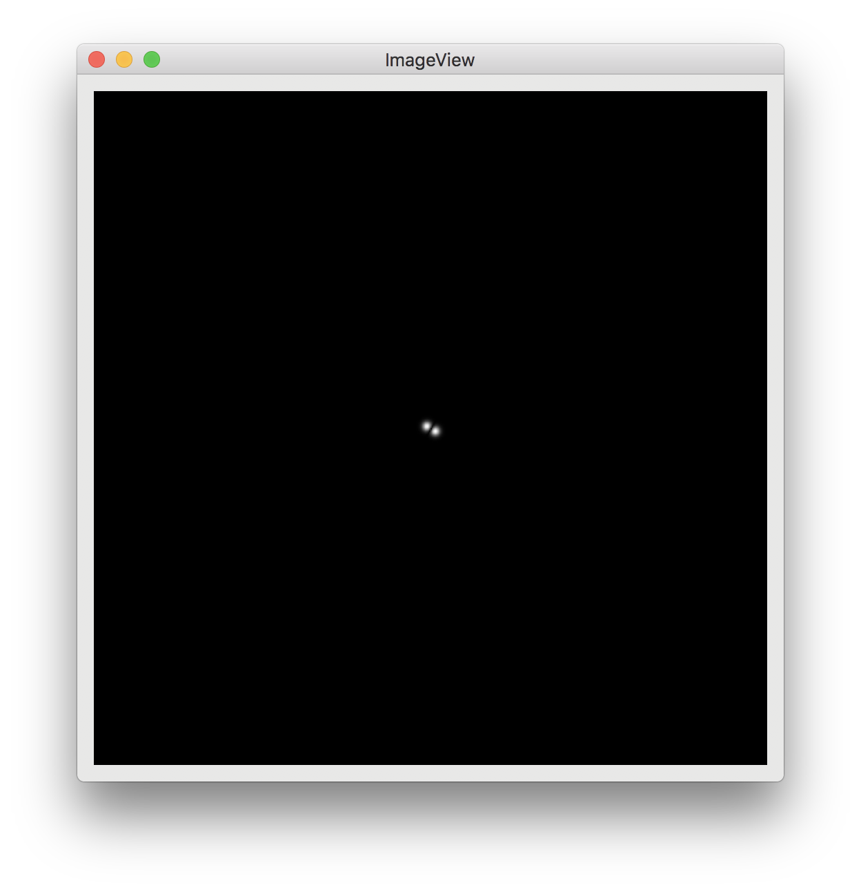
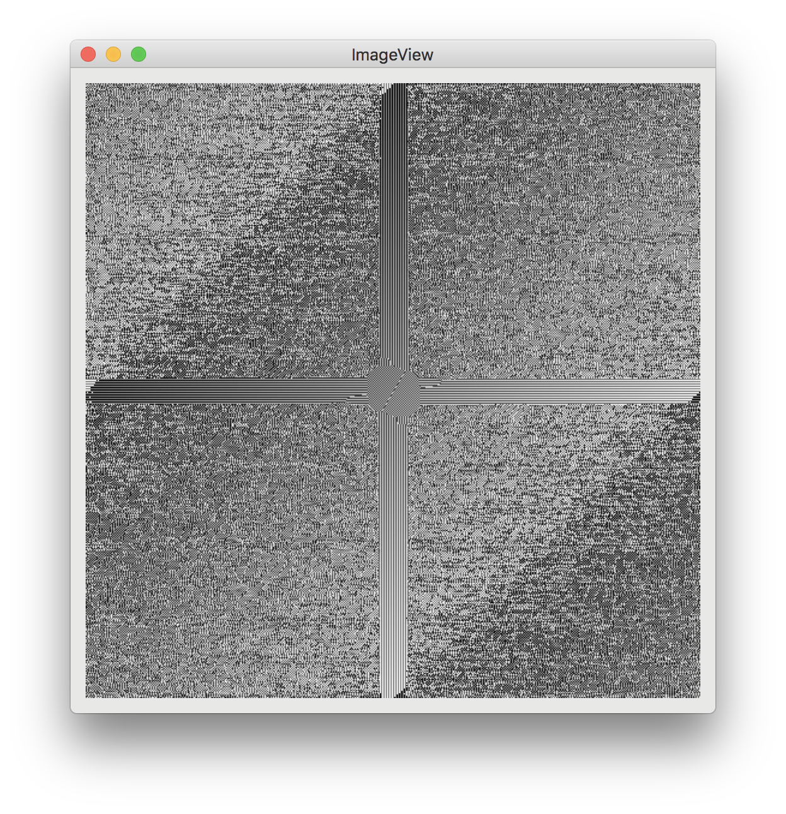

Getting off the ground with ``julia``. An example showing how to make a gabor, take the ``fft()`` and display some images.

Next step: using ``psychopy`` (more tricky...)

## installing julia

https://julialang.org/downloads/

## installing useful packages
https://juliaimages.org/latest/index.html

```julia
using Pkg
Pkg.add("Images")
Pkg.add("ImageShow")
Pkg.add("Plots")
Pkg.add("FFTW")
```

## make a bash alias

to avoid having to double-click... and can start from shell
```bash
alias julia1='/Applications/Julia-1.1.app/Contents/Resources/julia/bin/julia'
```
add to `.bash_profile` and restart shell.

## using it / running code

```bash
julia
```



```julia
using FFTW
using Images, ImageShow

# make a gabor
nPixels = 512;

# for x/y grid
r = range(-3π, 3π, length = nPixels)
sigma = 3.1;
lambda = 1.2;
theta = π ./ 3;

# list comprehension to create image
# [  (expr of x and y)  FOR x in r, y in r ]
X = [ sin(lambda .* (x.*cos(theta) + y.*sin(theta))) .* exp(-(x.^2+y.^2)/sigma) for x in r, y in r ]

# display
imshow(X)

# FFT and shifting...
Xf = fftshift( fft(X) );

# show mag and phase of FFT
imshow( abs.(Xf));
imshow( angle.(Xf));
```

<center>


</center>

## using ``psychopy`` from ``julia``

For stimulus display + running experiments, you might 
https://github.com/schluppeck/psychopy-from-julia

## notes


```bash
brew install youtube-dl
```
